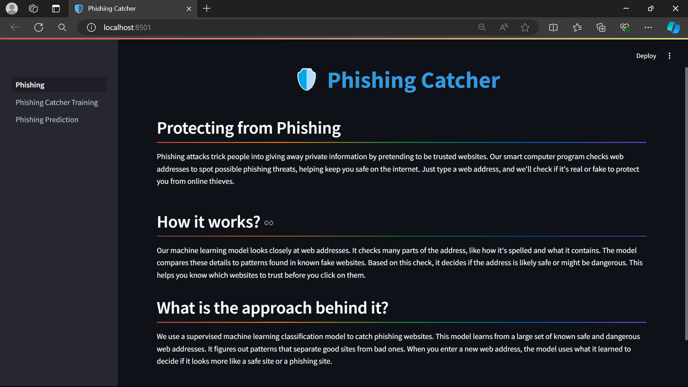
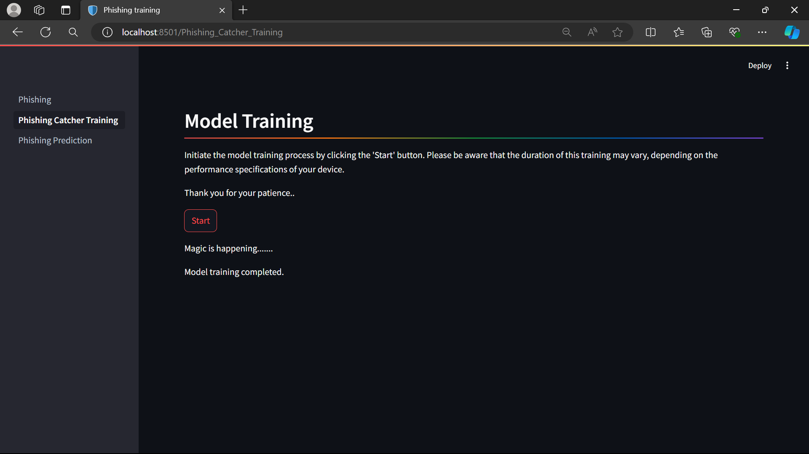
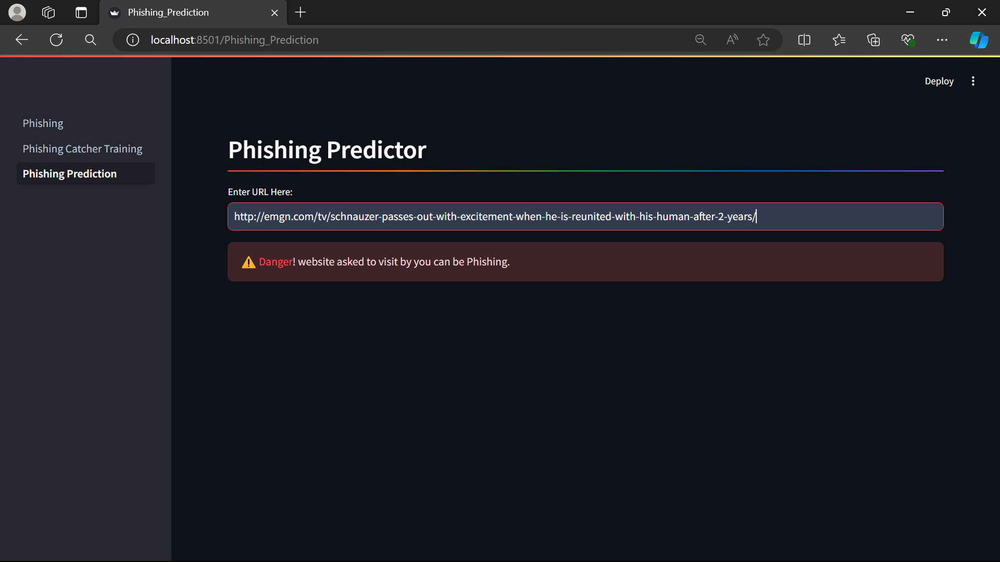
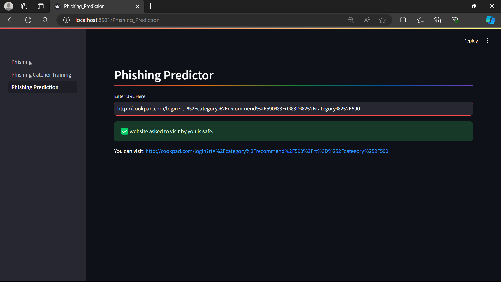

# Phishing Classifier

Our machine learning model looks closely at web addresses. It checks many parts of the address, like how it's spelled and what it contains. 

The model compares these details to patterns found in known fake websites. Based on this check, it decides if the address is likely safe or might be dangerous. This helps you know which websites to trust before you click on them.

<details open="open">
  <summary>Table of Contents</summary>
  <ol>
    <li>
      <a href="#Approach">Approach</a>
    </li>
    <li>
      <a href="#Features">Features</a>
    </li>
    <li>
      <a href="#Technologies">Technologies</a>
    </li>
    <li>
      <a href="#Prototype">Protoype</a>
    </li>
    <li>
	    <a href = "#How-to-Start-Project">How to Start Project</a>
    </li>
    <li>
	    <a href = "#Contact-Us">Contact Us</a>
    </li>
    <li>
	    <a href = "#License">License</a>
    </li>
  </ol>
</details>

## Approach
- We use a supervised machine learning classification model to catch phishing websites. 
- This model learns from a large set of known safe and dangerous web addresses. 
- It figures out patterns that separate good sites from bad ones. 
- When you enter a new web address, the model uses what it learned to decide if it looks more like a safe site or a phishing site.


## Features
- Phishing attacks trick people into giving away private information by pretending to be trusted websites. 
- Our smart computer program checks web addresses to spot possible phishing threats, helping keep you safe on the internet. 
- Just type a web address, and we'll check if it's real or fake to protect you from online thieves.

## Technologies
- Python
- Streamlit
- RandomForestClassifier

## Prototype:

<div style="display:flex; flex-wrap:wrap; gap:2%; justify-content:center;">




</div>

## How to Start Project

Follow these steps to get started with the project:

1. **Clone the Repository:**
   ```bash
   git clone <repository_link>
   ```
2. **Install Anaconda:**
   
   Make sure you have Anaconda installed on your system. If not, you can download and install it from the official website: https://www.anaconda.com/download/
   
4. **Create a Virtual Environment:**
   
   Create a new virtual environment using Python 3.8:

   ```bash
   conda create --name your_env_name python=3.8 -y
   ```
   Replace your_env_name with the desired name for your virtual environment.
   
   Activate the newly created environment:
   ```bash
   conda activate your_env_name
   ```
5. **Install Dependencies:**
   
   Install the project dependencies by running:
   ```bash
   pip install -r requirements.txt
   ```
   This command will install all the required packages listed in the requirements.txt file.

7. **Run the Streamlit App:**
   ```bash
   streamlit run Home.py
   ```
   This command will start the Streamlit app.

## Contact Us

To learn more about, please reach out:

📧 suzalkachhadiya111@gmail.com

## License

This project is licensed under the MIT License - see the [LICENSE](LICENSE) file for details.